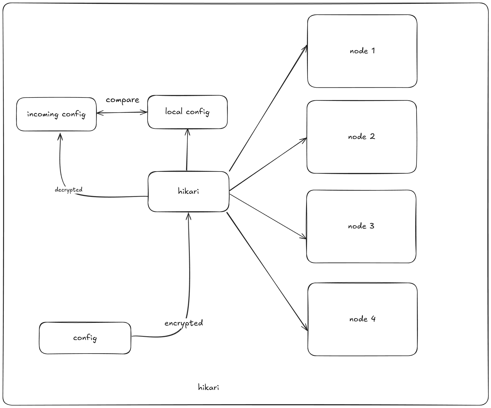
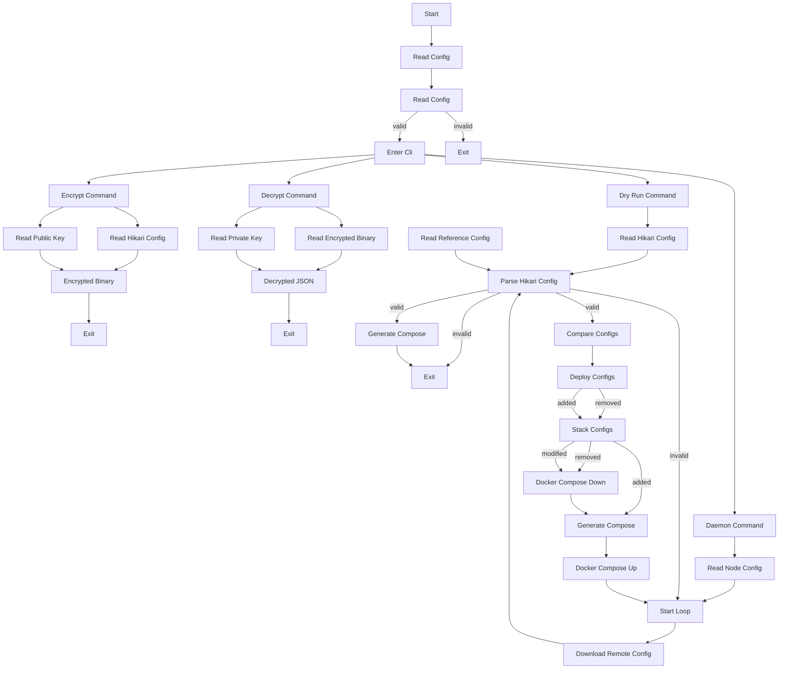
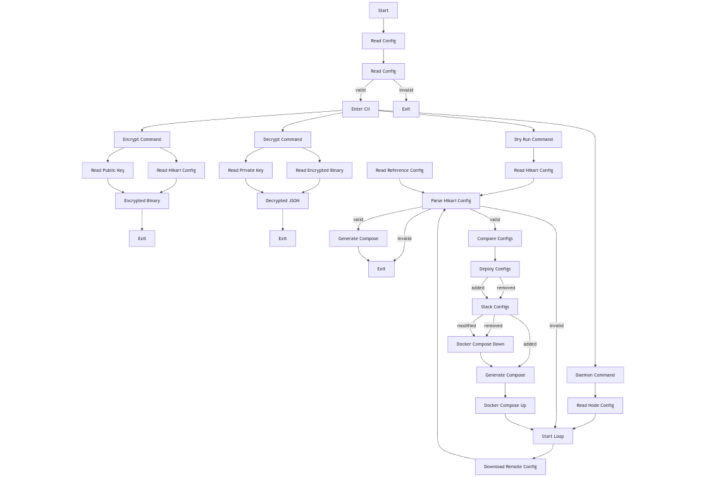
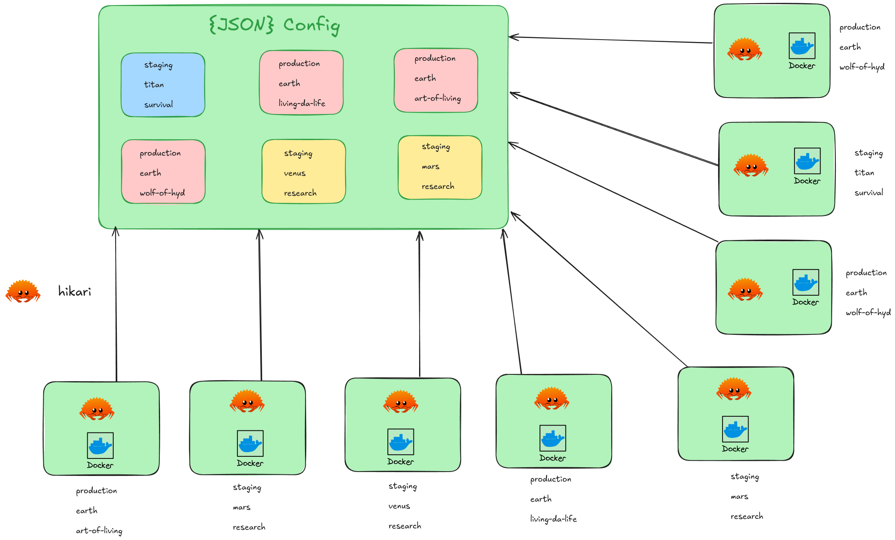

# hikari

## What is Hikari?

Hikari is a daemonic application that operates as an agent on virtual machines. Its primary function is to streamline deployments by regularly checking for updates in a remote configuration file and applying only the necessary changes. This precision ensures your deployment remains up-to-date without unnecessary overhead.

If your deployment environment consists of two or three nodes (machines) with specific use cases, or if you’re juggling multiple VMs with frequent configuration changes, Logging in and out to edit files manually across nodes becomes tedious quickly. Hikari automates this process, saving you time and effort.

[](./images/hikari-overview.png)

## How Hikari Works

With Hikari, deployment management is simple and efficient:

Centralized Configurations, define all your deployments in a single JSON file in the following definitions

- Environment (e.g., staging, production)
- Client (specific customers)
- Vertical Solution (specific services or applications)
- Container Management: Each deployment configuration contains arrays of stacks (like docker-compose.yml files) for services such as web or app, which can be defined

### Flowchart



flowchart as image

[](./images/mermaid-diagram.png)

### Example Configuration file

```json
{
  "version": "1",
  "deploy_configs": {

    // start of the deploy config
    "mars": {
      "client": "earth",
      "environment": "staging",
      "solution": "protection",
      "deploy_stacks": [

        // start of the first stack
        {
          "filename": "nginx_1.yaml",
          "home_directory": "/root/nginx1",
          "stack_name": "nginx-1",
          // this is the compose spec section
          "compose_spec": {
            // define your services / containers
            "services": {
              // container 1
              "nginx-2": {
                "container_name": "nginx-2", // required
                "environment": [
                  "HELLO=BYE"
                ], // optional
                "image": "nginx", // required
                "mem_limit": "1gb", // optional
                "mem_reservation": "1gb", // optional
                "oom_kill_disable": true, // optional
                "ports": [
                  "8081:8080"
                ], // optional
                "privileged": false, // optional
                "pull_policy": "always", // optional
                "restart": "unless-stopped", // required
                "stdin_open": false, // optional
                "tty": true, // optional
                "user": "0:0", // optional
                "volumes": [
                  "/root:/logs"
                ] // optional, all volumes should be absolute paths
              },
              // container 2
              "nginx_1": {
                "container_name": "nginx-1",
                "environment": [
                  "HELLO=BYE"
                ],
                "image": "nginx",
                "mem_limit": "1gb",
                "mem_reservation": "1gb",
                "oom_kill_disable": true,
                "ports": [
                  "8080:8080"
                ],
                "privileged": false,
                "pull_policy": "always",
                "restart": "unless-stopped",
                "stdin_open": false,
                "tty": true,
                "user": "0:0",
                "volumes": [
                  "/root:/logs"
                ]
              }
            }
          }
        },
        // start of the second stack
        {
          "filename": "ubuntu_1.yaml",
          "home_directory": "/root/ubuntu1",
          "stack_name": "ubuntu-1",
          "compose_spec": {
            "services": {
              "ubuntu_1": {
                "container_name": "ubuntu-1",
                "environment": [
                  "HELLO=BYE"
                ],
                "image": "ubuntu",
                "mem_limit": "1gb",
                "mem_reservation": "1gb",
                "oom_kill_disable": true,
                "ports": [
                  "9000:8080"
                ],
                "privileged": false,
                "pull_policy": "always",
                "restart": "unless-stopped",
                "stdin_open": false,
                "tty": true,
                "user": "0:0",
                "volumes": [
                  "/root:/logs"
                ]
              }
            }
          }
        }
      ]
    }
  }
}
```

## How it looks when deployed

[](./images/hikari-config-explained.png)

### Features

- Multiple deployment configurations
- Any number of stacks within each configuration
- Dynamic Updates: Hikari automatically detects changes:
  - Additions trigger the deployment of new configurations.
  - Removals clean up unused containers and configurations.
  - Updates to individual containers prompt Hikari to restart the relevant stack for smooth application continuity.

## Security at the Core

Hikari comes with AES-256 encrytion and decryption out of the box, ensuring your configs remain confidential and secure from prying eyes

- Generate your own keys with Hikari's utility.
- Seamless Integration: Encrypt and decrypt files effortlessly during deployment.

## Hikari Command Overview

Hikari comes equipped with user-friendly commands to simplify your workflow:

1. `encrypt`: Encrypts your configuration files for secure deployment.

```shell
hikari encrypt -i config.json -o encrypted.bin
```

2. `decrypt`: Decrypts configuration files for editing or review.

```shell
hikari decrypt -i encrypted.bin -o config.json
```

3. `dry-run`: Tests your configuration before proceeding with deployment.

```shell
hikari dry-run -i config.json
```

4. `daemon`: Starts Hikari in daemon mode for continuous monitoring and updates.

```shell
hikari daemon
```

## Getting Started'

Generate your public and private keys using the following command

```shell
openssl genpkey -algorithm RSA -out private_key.pem -pkeyopt rsa_keygen_bits:4096
openssl rsa -pubout -in private_key.pem -out public_key.pem
```

Ensure the following files are in the same directory as the Hikari binary:

- node.toml: Contains node-specific configurations. example below

```toml
version = "1"
solution = "protection"
client = "earth"
environment = "staging"
```

- config.toml: configure how frequently you want to poll updates. example below

```toml
remote_url = "..." # publicly available encrypted file url
poll_interval = "10" # remote file poll interval
encrypted_file_path = "encrypted.bin" # filename & path where the encrypted file should be saved
decrypted_file_path = "decrypted.json" # filename & path where the decrypted json should be saved
reference_file_path = "reference.json" # filename & path where the current node config will be stored
```

- .env: Specifies paths to private and public keys.

```env
PRIVATE_KEY_FILENAME=private_key.pem # path to private key
PUBLIC_KEY_FILENAME=public_key.pem # path to public key
```

With this setup, Hikari takes care of the heavy lifting, ensuring seamless deployments with minimal manual intervention.

## Demo

[](https://www.youtube.com/watch?v=r44_lMHFXRo)

## Conclusion

Hikari is purpose-built for those seeking a lightweight, cost-effective, and secure solution for managing cloud deployments. Whether you're handling a handful of VMs or a specific use case for each node, Hikari eliminates the overhead , empowering you with a straightforward and seamless deployment process.

## How to Build

To build and run this Rust project, follow these steps:

### Prerequisites

1. **Clone the Repository:**
   First, clone the repository to your local machine:

     ```sh
    git clone https://github.com/theinhumaneme/hikari.git
    cd hikari
     ```
2. **Build the Project:**
   - Navigate to the project directory and run the following command to build the project:

     ```sh
     cargo build
     ```

   - This will compile the project and place the output in the `target/debug` directory. For a release build, you can use:

     ```sh
     cargo build --release
     ```

   - The release build output will be placed in the `target/release` directory.

### Running the Project

- To run the project after building, use the following command:

  ```sh
  cargo run
  ```
