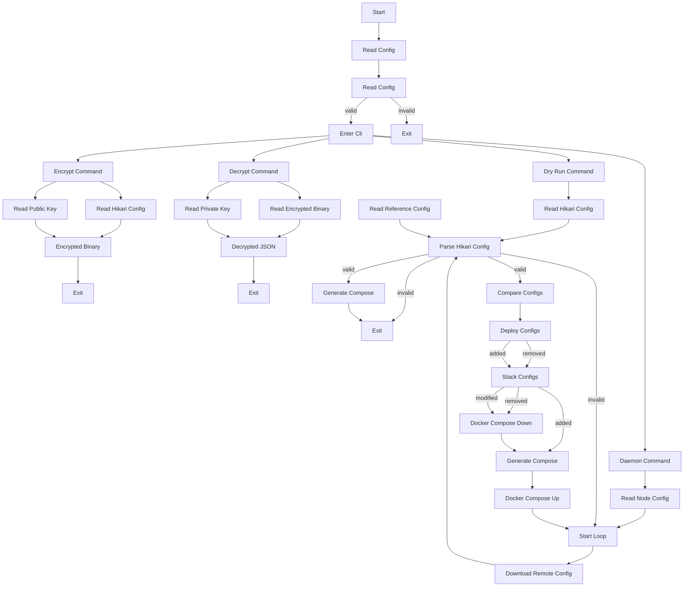

# hikari

Flowchart of the CLI

```mermaid
---
config:
  theme: light
---
flowchart TD

    start_hikari[Start] --> read_config
    read_config[Read Config] --> parse_config[Read Config]
    parse_config -->|valid| enter_cli[Enter Cli];
    parse_config -->|invalid| hikari_exit[Exit]
    enter_cli

    %% Encryption Command Flow
    enter_cli --> encrypt[Encrypt Command]
    encrypt --> read_input_json[Read Hikari Config] --> output_binary
    encrypt --> read_public_key[Read Public Key]  --> output_binary
    output_binary[Encrypted Binary]
    output_binary --> encryption_exit[Exit]

    %% Decryption Command Flow
    enter_cli --> decrypt[Decrypt Command]

    decrypt --> read_binary[Read Encrypted Binary] --> output_json
    decrypt --> read_private_key[Read Private Key] --> output_json
    output_json[Decrypted JSON] --> decryption_exit[Exit]

    %% Dry Run Command Flow
    enter_cli --> dry_run[Dry Run Command]
    dry_run --> read_input_json_dry_run[Read Hikari Config]
    read_input_json_dry_run --> parse_hikari_config[Parse Config]
    parse_hikari_config -->|invalid| dry_run_exit[Exit]
    parse_hikari_config -->|valid| generate_compose[Generate Compose]
    generate_compose --> dry_run_exit

    %% Daemon Command Flow
    enter_cli --> daemon[Daemon Command]
    daemon --> read_node_config[Read Node Config]
    read_node_config --> loop_start[Start Loop]
    loop_start --> pull_remote_file[Download Remote Config]
    read_reference_config[Read Reference Config] --> parse_hikari_config
    pull_remote_file --> parse_hikari_config[Parse Hikari Config]
    parse_hikari_config -->|invalid| loop_start
    parse_hikari_config -->|valid| compare_configs[Compare Configs]
    compare_configs --> loop_deploy_configs[Deploy Configs]
    loop_deploy_configs -->|removed| loop_stack_configs[Stack Configs]
    loop_deploy_configs -->|added| loop_stack_configs
    loop_stack_configs -->|removed| docker_compose_down[Docker Compose Down]
    loop_stack_configs -->|added| docker_generate_compose[Generate Compose]
    loop_stack_configs -->|modified| docker_compose_down --> docker_generate_compose
    docker_generate_compose --> docker_compose_start[Docker Compose Up]
    docker_compose_start --> loop_start

```
